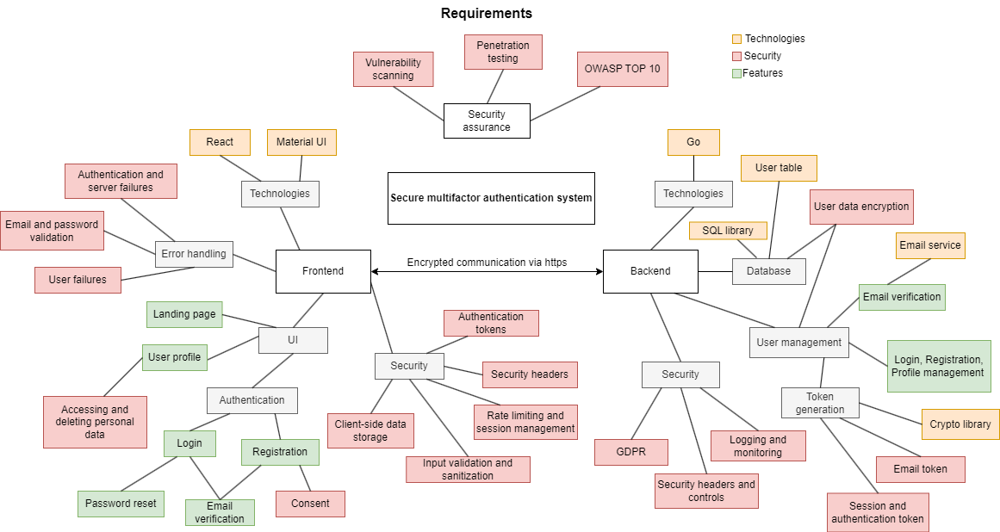

# MFAuthenticator
Multifactor authenticator web application following secure programming guidelines. The application aims to provide maximum security and high quality for a user-friendly authentication service.

## Backend
The backend is implemented with Golang and its libraries for security and performance. The backend consists of API endpoints for frontend components and most of the security features like database connection, storing and hashing passwords, rate limiting, validation and sanitization, sending emails, and handling token creation and expiration. The application uses PostgreSQL database with the connection strings and credentials currently hardcoded in the program for clarity and testing purposes.

## Frontend
Simple but polished React frontend for user interactions. Uses material UI library for styling. Includes components for registration, login, user view, password reset, logout, delete user, toolbar and landing page. Security measures like data validation and session timeout also implemented in the frontend.

Both the frontend and the backend need to be running in order for the program to work.



## Installing and running the software

### Prerequisites
- Node.js
- Postgre
- Go

```console
git clone <url> <directory>
```

### Running the frontend
In the frontend directory npm install to run install the dependencies and npm start to run the program locally.

### Running the backend
Running the backend requires installing Go language from https://golang.org/dl/ and setting it up. go run main.go in the backend directory to start the server.

### Email Service
The email service credentials are hardcoded to the code for clarity and the emails can be viewed with them from https://ethereal.email/messages email = lyric.kassulke@ethereal.email and password = "BApZS1RRjXfxzG21MW". User can also create own credentials, but basically these are just mockup data.

### Installing and running postgre
Install postgreSQL from their site and create master user postgre. Set your own password.
pg_ctl -D "C:\Program Files\PostgreSQL\16\data" start to run postgre in windows

### Creating and running the database
```console
psql -U postgres
CREATE DATABASE authenticator;
CREATE TABLE users ( ID SERIAL PRIMARY KEY, first_name VARCHAR(50) NOT NULL, last_name VARCHAR(50) NOT NULL, email VARCHAR(255) UNIQUE NOT NULL, password VARCHAR(128) NOT NULL, email_confirmed BOOLEAN NOT NULL, verification_code VARCHAR(6) NOT NULL );
CREATE TABLE reset_tokens ( ID SERIAL PRIMARY KEY, email VARCHAR(255) NOT NULL, token VARCHAR(255) NOT NULL, created_at TIMESTAMP DEFAULT CURRENT_TIMESTAMP );
```
### Example view users from the table
```console
\c authenticator
SELECT * FROM users;
```

## Security measures implemented
List of secure programming solutions implemented to the application
#### Consent of the data subject
Every user who registers to the application is explicitly shown the conditions for the usage of the application. The consent is unchecked by default and the registration requires checking the consent box to work. User can delete and see all the data that he or she has given.
#### User information and password validition on client and server
Includes password strength validation, email formatting and uniqueness, limits for input sizes and sanitization and validation on frontend and backend for input actions.
#### Error handling
Server errors are displayed with error message and appropriate HTTP code in the console. If methods fail due to user failures, errors are handled and displayed to guide the user.
#### Password encryption
The passwords of users are encrypted in the backend before storing to database using bcrypt hashing algorithm.
#### SQL injection
SQL queries are parametrized and the user input is whitelist validated and sanitized for special characters on both client and server side to prevent inserting malicious queries.
#### Secure routing
Access to user pages is denied by default by redirecting user to login if missing credentials. If page is not found a screen indicating error is shown. The user view page is secured with jwt token.
#### Session timeout
After succesful login session jwt token, which expires after 30 minutes, is sent to the client. The application checks the jwt token expiry in its operations and if it has expired user needs to log in again. Frontend also listens for user actions and timeouts the session after 10 minutes of inactivity.
#### Rate limiting
To deny brute force attacks rate limiting is implemented with Go rate limiting library. It allows 5 login attempts per minute when cooldown is added to login.
#### Client-side data storage
Passwords aren't stored in the client side and data is stored and shown only for valid jwt token holder in the frontend. The backend expects a valid JWT token in the user data fetch request.
#### Security headers
Backend allows only certain http request type based on the endpoint. Other endpoints are denied, and the CORS policies have been set to require certain headers and valid jwt token for requests. The requests are set to be allowed from all origins since https is not implemented and the software is in testing state.
#### Email verification
After registration an email link with secure code is sent to user that must be confirmed before the account is available. If user attempts to login before the email is confirmed he or she is encouraged to check the email and verify it and then proceed to login. Email sending is handled with ethereal for testing purposes and mockup data for sending is available in the source code. Use the credentials to access the mails at https://ethereal.email/messages.
#### Password reset
Password resetting is handled in the UI with simple email field, that is used to get email for ethereal. When appropriate email is provided, secure link with code is sent to the given email and by clicking it the user directed to page where the user can set a new password.

## Limitations and further development
- Some hardcoded fields have been left to the application for testing purposes and easier set up
- No https implemented
- No monitoring and logging implemented
- emails are sent with mockup service instead of real email provider
